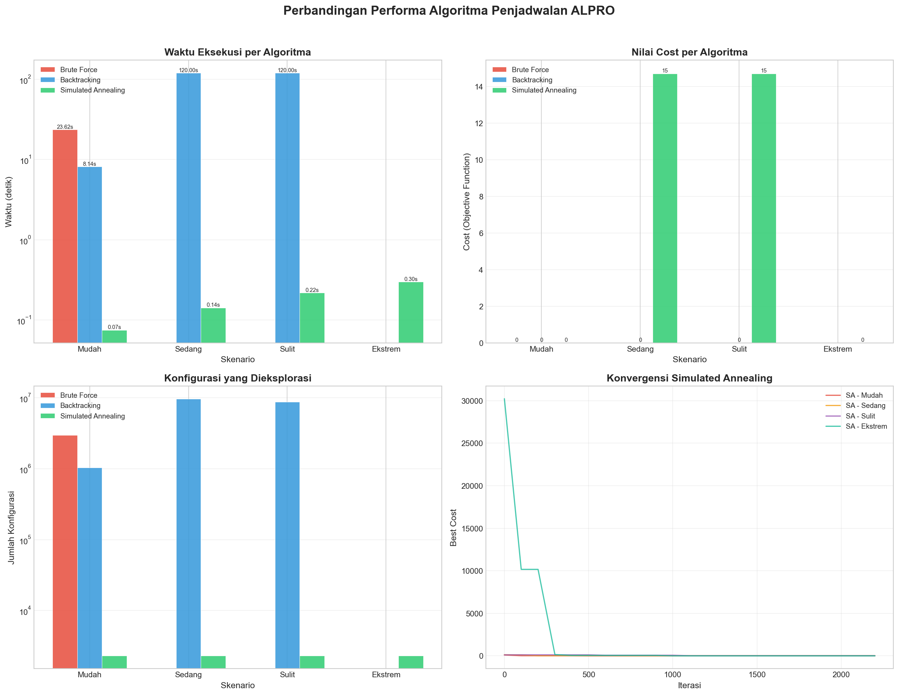
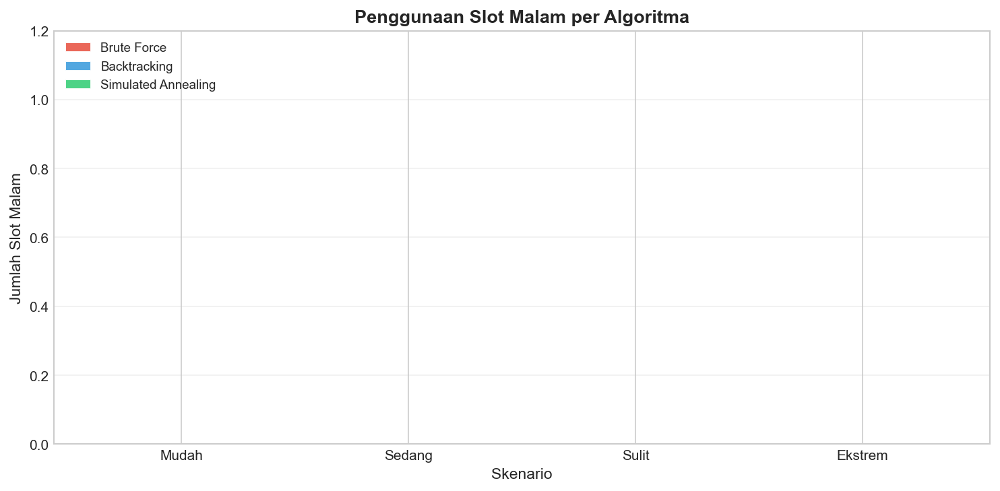

# Analisis Algoritma Brute Force, Backtracking, dan Simulated Annealing pada Penjadwalan Ulang Asisten Praktikum Berpasangan untuk Mengatasi Benturan Jadwal Praktikum, Kuliah Asisten, dan Kuliah Praktikan di Prodi Informatika Undip

Dokumentasi penelitian dan implementasi kode program untuk perbandingan performa algoritma penjadwalan ulang asisten praktikum berpasangan di Program Studi Informatika, Universitas Diponegoro. Penelitian ini bertujuan untuk meminimalkan benturan antara jadwal praktikum, jadwal kuliah asisten (Semester 4), dan jadwal kuliah praktikan (Semester 2).

---

## Informasi Peneliti
* **Nama** : Gaza Al Ghozali Chansa
* **NIM** : 24060123140183
* **Afiliasi** : Departemen Informatika, Fakultas Sains dan Matematika, Universitas Diponegoro
* **Lokasi** : Semarang, Indonesia
* **Kontak** : [gazaalghozalichansa@students.undip.ac.id](mailto:gazaalghozalichansa@students.undip.ac.id)

---

## Abstrak Penelitian
Penjadwalan mata kuliah atau praktikum di perguruan tinggi merupakan salah satu varian dari *University Course Timetabling Problem* (UCTP) yang tergolong ke dalam masalah optimasi kombinatorial berkategori **NP-Hard**. Masalah menjadi lebih kompleks pada praktikum Algoritma dan Pemrograman (ALPRO) karena setiap kelas praktikum harus diampu oleh **dua asisten praktikum berpasangan** yang tidak boleh memiliki bentrok jadwal dengan kuliah mereka sendiri maupun kuliah para praktikan semester 2.

Penelitian ini membandingkan tiga pendekatan algoritma:
1. **Brute Force** (Pencarian Exhaustive) - Mengeksplorasi seluruh ruang solusi untuk menjamin pencarian solusi optimal global, namun memiliki kompleksitas waktu eksponensial O((S * P)^C).
2. **Backtracking** (Pencarian Berbasis Pohon dengan Pruning) - Melakukan penelusuran secara *depth-first search* dengan memotong (*pruning*) cabang pencarian yang tidak layak sejak dini berdasarkan pemenuhan *hard constraints*.
3. **Simulated Annealing** (Metaheuristik Probabilistik) - Memodelkan proses pendinginan logam untuk melompat keluar dari jebakan *local optima* melalui penerimaan solusi yang lebih buruk dengan probabilitas tertentu berdasarkan temperatur sistem.

Pengujian dilakukan dalam empat skenario dengan tingkat kompleksitas yang meningkat: **Mudah**, **Sedang**, **Sulit**, dan **Ekstrem**. Hasil pengujian menunjukkan bahwa **Brute Force** hanya efektif pada skala sangat kecil (Mudah). **Backtracking** sangat efisien pada skenario Sedang dan Sulit dengan menemukan solusi optimal mutlak (Cost = 0). Sementara itu, **Simulated Annealing** menunjukkan skalabilitas tertinggi dengan berhasil menemukan solusi valid pada seluruh skenario termasuk skenario Ekstrem dalam waktu eksekusi yang sangat singkat (< 0.3 detik).

---

## Pemodelan Matematika & Batasan Masalah

### 1. Definisi Himpunan & Konstanta
* Himpunan kelas praktikum ALPRO `C` (12 kelas: ALPRO A1 s.d. F2).
* Himpunan slot waktu `S` (30 slot waktu: 5 hari kerja x 6 rentang waktu).
* Himpunan asisten praktikum `A` (6 asisten).
* Himpunan pasangan asisten berpasangan `P`, dengan jumlah P = A * (A - 1) / 2 = 15 pasangan unik.

### 2. Variabel Keputusan
Jadwal dimodelkan sebagai variabel keputusan biner `x(i, s, p)` di mana:
* `x(i, s, p) = 1`, jika kelas praktikum `i` (dalam `C`) dijadwalkan pada slot waktu `s` (dalam `S`) dengan diampu oleh pasangan asisten `p` (dalam `P`).
* `x(i, s, p) = 0`, jika lainnya (tidak dijadwalkan).

Setiap kelas praktikum harus mendapatkan tepat satu slot waktu dan satu pasangan asisten:
```text
Jumlah_s_dalam_S( Jumlah_p_dalam_P( x(i, s, p) ) ) = 1,  untuk setiap i dalam C
```

### 3. Batasan Masalah (Constraints)

#### A. Hard Constraints (Wajib Dipenuhi)
1. **Bentrok Kuliah Praktikan**: Slot waktu praktikum tidak boleh bertabrakan dengan jadwal kuliah wajib mahasiswa semester 2 (praktikan).
2. **Bentrok Kuliah Asisten**: Slot waktu praktikum tidak boleh bertabrakan dengan jadwal kuliah asisten praktikum yang bertugas (mahasiswa semester 4).
3. **Batas Beban Asisten**: Setiap asisten tidak boleh mengampu lebih dari batas maksimal kelas (MaxLoad = 4 kelas).
4. **Bentrok Tugas Asisten**: Seorang asisten tidak boleh mengampu lebih dari satu kelas praktikum pada slot waktu yang saling beririsan (*overlapping*).
5. **Slot Waktu Terlarang**: Slot Senin s.d. Rabu pukul 07.00 - 09.40 ditetapkan sebagai slot terlarang karena dialokasikan untuk kegiatan akademis lainnya.

#### B. Soft Constraints (Dioptimalkan)
1. **Minimisasi Slot Malam**: Slot malam (pukul 18.15 - 20.15) dihindari dan dikenai penalti jika digunakan.
2. **Keseimbangan Beban Mengajar**: Distribusi jumlah kelas yang diampu antar asisten diupayakan seimbang untuk menghindari keletihan mengajar.

### 4. Fungsi Objektif (Cost Function)
Kualitas jadwal dinilai berdasarkan fungsi biaya berikut (semakin rendah nilai cost, semakin baik kualitas jadwal):

```text
F(x) = Wh * H(x) + Wm * M(x) + Wb * B(x) + Wu * U(x)
```

Dimana:
* `H(x)`: Jumlah pelanggaran hard constraints (dengan bobot penalti Wh = 10.000).
* `M(x)`: Jumlah kelas yang dijadwalkan pada slot malam (dengan bobot penalti Wm = 50).
* `B(x)`: Deviasi standar (std dev) distribusi beban mengajar antar asisten (dengan bobot penalti Wb = 30).
* `U(x)`: Jumlah kelas praktikum yang tidak berhasil dijadwalkan (dengan bobot penalti Wu = 5.000).

---

## Skenario Pengujian

Eksperimen dirancang ke dalam 4 tingkatan skenario untuk menguji kinerja komputasi dan skalabilitas algoritma:

| Skenario | Jumlah Kelas (C) | Jumlah Slot Valid (S) | Jumlah Asisten (A) | Jumlah Pasangan (P) | Ruang Solusi Teoritis ((S * P)^C) |
| :--- | :---: | :---: | :---: | :---: | :---: |
| **Mudah** | 3 kelas | 24 slot | 4 asisten | 6 pasangan | 144^3 = 2,98 x 10^6 |
| **Sedang** | 6 kelas | 24 slot | 5 asisten | 10 pasangan | 240^6 = 1,91 x 10^14 |
| **Sulit** | 9 kelas | 24 slot | 6 asisten | 15 pasangan | 360^9 = 1,01 x 10^23 |
| **Ekstrem**| 12 kelas | 21 slot | 6 asisten | 15 pasangan | 315^12 = 1,46 x 10^30 |

---

## Hasil Eksperimen

Berikut adalah data hasil eksekusi program perbandingan algoritma pada sistem komputer dengan parameter konfigurasi standar (Random Seed: 42, Batas Waktu Backtracking: 120 detik, Iterasi Maksimum SA: 50.000):

### 1. Tabel Perbandingan Kinerja Komputasi

| Skenario | Algoritma | Solusi Valid? | Pelanggaran HC | Nilai Cost | Konfigurasi Dieksplorasi | Waktu Eksekusi (s) | Kelas Terjadwal |
| :--- | :--- | :---: | :---: | :---: | :---: | :---: | :---: |
| **Mudah** | Brute Force | ✓ Ya | 0 | **0.00** | 2,985,984 | 23.6182 | 3 / 3 |
| | Backtracking | ✓ Ya | 0 | **0.00** | 1,039,896 | 8.1359 | 3 / 3 |
| | Simulated Annealing | ✓ Ya | 0 | **0.00** | **2,297** | **0.0748** | 3 / 3 |
| **Sedang**| Brute Force | *Skipped* | - | - | - | - | - |
| | Backtracking | ✓ Ya | 0 | **0.00** | 9,725,883 | 120.0001 | 6 / 6 |
| | Simulated Annealing | ✓ Ya | 0 | 14.70 | **2,297** | **0.1422** | 6 / 6 |
| **Sulit** | Brute Force | *Skipped* | - | - | - | - | - |
| | Backtracking | ✓ Ya | 0 | **0.00** | 8,726,563 | 120.0004 | 9 / 9 |
| | Simulated Annealing | ✓ Ya | 0 | 14.70 | **2,297** | **0.2174** | 9 / 9 |
| **Ekstrem**| Brute Force | *Skipped* | - | - | - | - | - |
| | Backtracking | *Skipped* | - | - | - | - | - |
| | Simulated Annealing | ✓ Ya | 0 | **0.00** | **2,297** | **0.2993** | 12 / 12 |

> [!NOTE]
> * **Skipped** pada Brute Force dilakukan sejak awal skenario Sedang karena ukuran pencarian melampaui kemampuan komputasi waktu nyata.
> * **Skipped** pada Backtracking skenario Ekstrem dilakukan karena kompleksitas ruang pencarian terlalu tinggi untuk diselesaikan dalam batas waktu rasional.
> * Nilai cost **14.70** pada Simulated Annealing (skenario Sedang dan Sulit) disebabkan oleh ketidakseimbangan kecil beban mengajar antar asisten (*load imbalance*), namun jadwal tetap **100% valid** (pelanggaran *hard constraint* = 0).

### 2. Analisis & Kesimpulan Algoritma
1. **Brute Force**: Hanya mampu menyelesaikan skenario Mudah dengan mengeksplorasi seluruh kombinasi secara mendalam. Tidak praktis untuk penjadwalan dunia nyata akibat ledakan kombinatorial.
2. **Backtracking**: Sangat unggul dalam menemukan solusi dengan kualitas terbaik (Cost = 0.00) pada skenario menengah berkat mekanisme pemangkasan cabang tidak layak. Namun, ketika ruang solusi meningkat tajam (skenrio Ekstrem), algoritma kehabisan waktu sebelum berhasil menyelesaikan pencarian atau melakukan *backtrack* penuh.
3. **Simulated Annealing**: Merupakan algoritma paling andal dan skalabel untuk permasalahan praktis ini. SA mampu menghasilkan solusi jadwal yang sepenuhnya valid (tidak ada bentrok dan melanggar aturan) pada seluruh skenario termasuk skenario terberat (Ekstrem, 12 kelas) hanya dalam waktu **0.2993 detik** dan mengeksplorasi iterasi yang sangat minimal.

### 3. Visualisasi Grafik Perbandingan Performa

Berikut adalah grafik visualisasi hasil perbandingan performa algoritma yang dihasilkan langsung oleh program:

#### Grafik Perbandingan Performa Umum (Waktu Eksekusi, Cost, Eksplorasi, & Konvergensi SA)


#### Grafik Penggunaan Slot Malam (Soft Constraint)


---

## Struktur Direktori Kode Program

Kode program diorganisasikan dengan arsitektur modular untuk mempermudah eksperimen, pemeliharaan, dan skalabilitas di masa depan:

```bash
├── README.md                          # Dokumentasi penelitian (file ini)
├── main.py                            # Entry point utama program eksperimen
├── config.py                          # Parameter penalti cost & konfigurasi SA
├── hasil_perbandingan_algoritma.csv  # Ekspor hasil pengujian skenario
├── grafik_perbandingan_algoritma.png  # Grafik waktu eksekusi, cost, & konvergensi
├── grafik_slot_malam.png              # Grafik analisis optimalitas slot malam
│
├── algorithms/                        # Implementasi algoritma penjadwalan
│   ├── __init__.py
│   ├── brute_force.py                 # Algoritma pencarian exhaustive
│   ├── backtracking.py                # Algoritma pencarian terarah dengan pruning
│   └── simulated_annealing.py         # Algoritma metaheuristik probabilistik
│
├── constraints/                       # Logika pengecekan aturan penjadwalan
│   ├── __init__.py
│   └── validators.py                  # Validator overlap, slot terlarang, & beban
│
├── data/                              # Dataset simulasi penjadwalan
│   ├── __init__.py
│   ├── classes.py                     # Definisi 12 kelas praktikum ALPRO
│   ├── assistants.py                  # Profil 6 asisten & jadwal kuliah semester 4
│   ├── slots.py                       # Pembangkitan 30 slot waktu praktikum
│   └── students.py                    # Jadwal kuliah wajib praktikan semester 2
│
├── objectives/                        # Perhitungan fungsi objektif (optimasi)
│   ├── __init__.py
│   └── cost.py                        # Perhitungan nilai cost & metrik kualitas
│
├── evaluation/                        # Modul pengujian & visualisasi hasil
│   ├── __init__.py
│   ├── scenarios.py                   # Pembangkit skenario (Mudah s.d. Ekstrem)
│   ├── runner.py                      # Driver pengeksekusi seluruh eksperimen
│   ├── display.py                     # Visualisasi terminal tabel hasil & beban
│   ├── charts.py                      # Pembuat grafik perbandingan (Matplotlib)
│   └── conclusions.py                 # Penampil kesimpulan analisis eksperimen
│
└── utils/                             # Utilitas pendukung
    └── time_utils.py                  # Konversi string jam ke menit & format slot
```

---

## Panduan Menjalankan Program

### 1. Prasyarat Sistem
Pastikan Anda memiliki Python (versi 3.8 atau yang lebih baru) terinstal di sistem Anda, beserta pustaka Python pendukung berikut:
```bash
pip install pandas matplotlib
```

### 2. Eksekusi Program
Jalankan perintah berikut di terminal pada direktori utama proyek:
```bash
python main.py
```

### 3. Hasil Output
Setelah program selesai dijalankan, Anda akan melihat kesimpulan komparatif pada layar terminal dan file-file berikut akan terbuat secara otomatis di direktori utama:
1. `hasil_perbandingan_algoritma.csv`: Berisi tabel ringkasan perbandingan data numerik dari semua algoritma di setiap skenario.
2. `grafik_perbandingan_algoritma.png`: Visualisasi berupa grafik batang perbandingan waktu eksekusi, nilai cost, jumlah konfigurasi tereksplorasi, dan grafik konvergensi pencarian Simulated Annealing.
3. `grafik_slot_malam.png`: Grafik perbandingan penggunaan slot malam untuk masing-masing algoritma pada setiap skenario.

---

*Penelitian ini disusun sebagai proyek analisis komparatif dalam Makalah Analisis dan Strategi Algoritma Semester Genap 2025/2026, Program Studi Informatika Universitas Diponegoro.*
